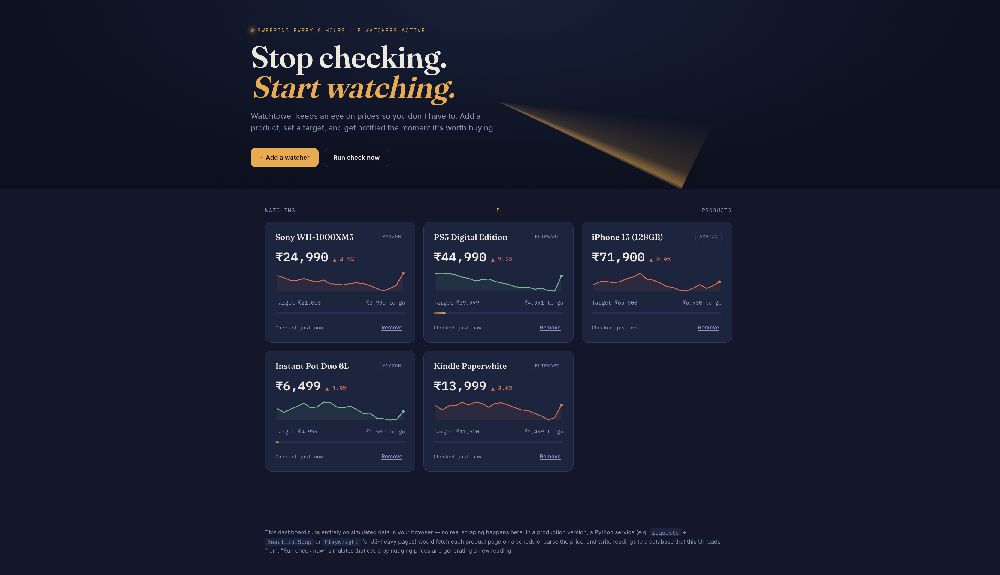

# Watchtower

I got tired of re-checking the same product pages over and over hoping a price would drop, so I built the tool I actually wanted: add something you're watching, set a price you'd actually buy it at, and let the dashboard tell you when it's worth going back.



## Where this is at right now

Right now the whole thing runs on made-up data. There's no actual scraper behind it yet — "Run check now" just nudges the numbers around to simulate what a real check would look like. I built it this way on purpose: I wanted to get the interface and the interaction feel right before touching anything as annoying as scraping Amazon (which actively tries to stop you, for what it's worth).

The real version would swap the mock data generator for a small Python service — probably `requests` + `BeautifulSoup` for most sites, `Playwright` for the ones that render prices in JS — writing readings into a database on a schedule. This dashboard would just point at that instead of generating fake history client-side. That's the next thing I'm building.

## What it actually does

- Track a product with a current price and a price you're willing to pay
- Shows price history as a little sparkline per card
- "Run check now" simulates a fresh price pull and pings you if something crosses your target
- A progress bar shows how close a product is to the price you set

## Running it

It's one HTML file, no dependencies, no build step. Just open `index.html`, or if you want it served properly:

```bash
python3 -m http.server 8000
```

then go to `localhost:8000`.

## Still to build

- The actual scraper (this is the part I'm least looking forward to and most excited about)
- Somewhere to store price history that isn't just browser memory
- A way to run checks on a schedule without me having to click a button
- Notifications that don't require the tab to be open — email or a Discord webhook probably

## License

MIT
